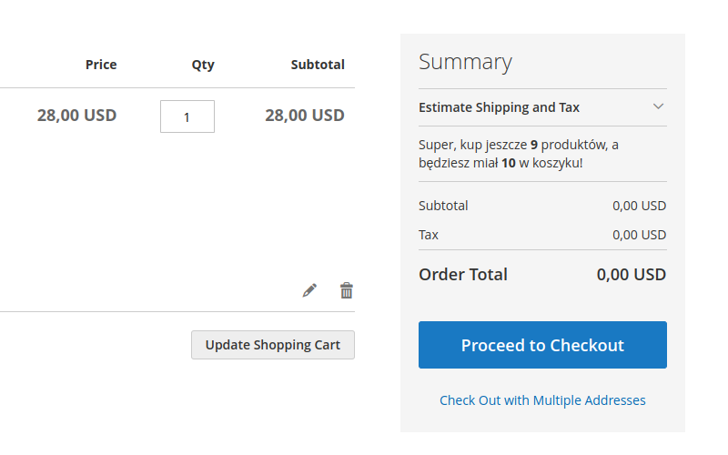
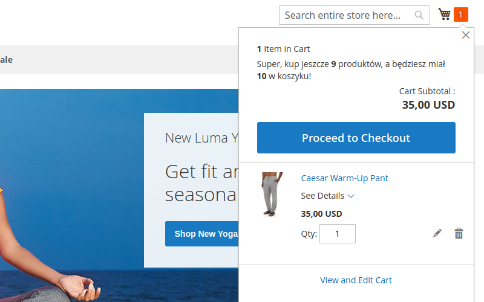
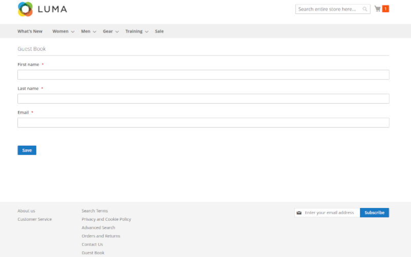
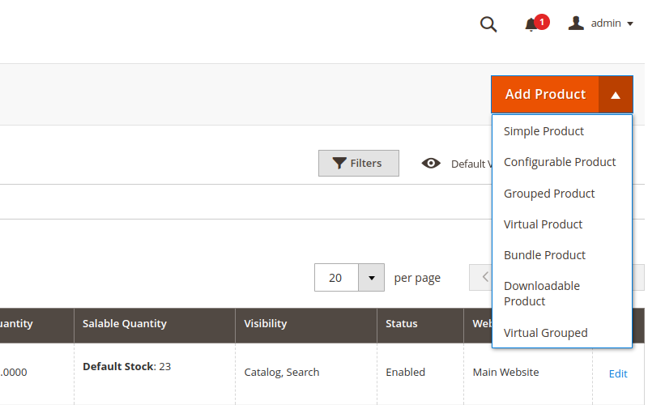

# Magento 2 Modules

## GateCheckout
Displays short information above the **subtotal** fields in minicart card and also on the checkout cart page.

## GateGuest
Very simple guest book implementation. Saves information provided in the form available on the store page, saves it to database after simple validation. Form can be accessed from the link in the footer of the page.

## GateType
Creates new product type called Virtual Grouped.

## CRON SCRIPT
Located with sample output file in cronscript directory. Script needs credentials for magento database, configuration requires mysql server address, user name, password and database name. Depending on your server configuration you might need to output csv file to a specific location or change secure-file-priv option in your mysql server configuration for script to work properly

Add this script to your crontab file (crontab -e) : 0 3 * * *  path_to_the _script. This will run this cron job every day at 3 am.
