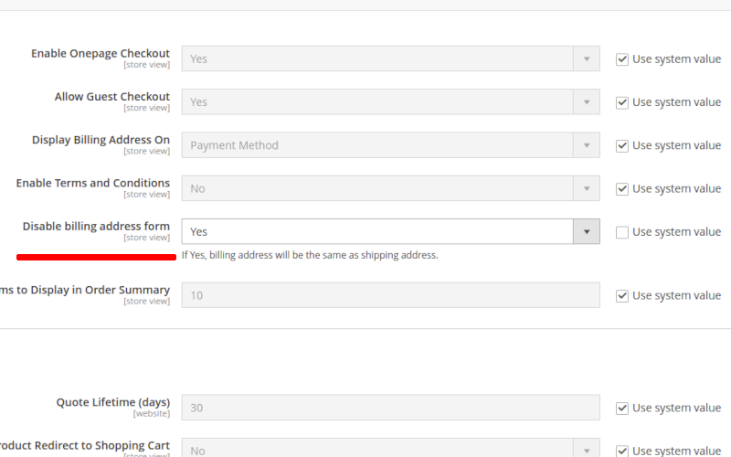
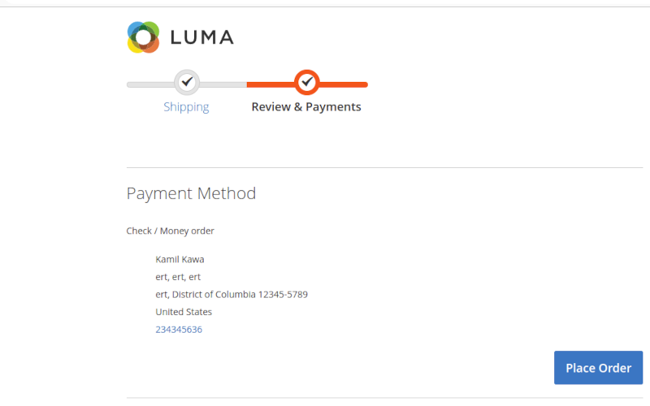

# Magento 2 Modules
## Gate gallery
Module displays images from gallery in static block using magento jquery gallery widget. User can create his own gallery, view, edit and delete existing ones.

__Displaying gallery__

__New gallery - ui component form__

__List of existing galleries - ui component listing__

__Gallery preview__

__Edit form -ui component form__

## GatePay
Adds new payment method to checkout page

Module configuration page

**Currently module requires payu store automatic capture to be enabled.**

After successful order user is redirected to payu payment page

After confirmation is send from payu order is invoiced. If payment is canceled, authorization is voided and order is cancelled.

Successful transaction

Canceled payment

## GateCheckout
Displays short information above the **subtotal** fields in minicart card and also on the checkout cart page.

## GateGuest
Very simple guest book implementation. Saves information provided in the form available on the store page, saves it to database after simple validation. Form can be accessed from the link in the footer of the page.

## GateType
Creates new product type called Virtual Grouped.

## CRON SCRIPT
Located with sample output file in cronscript directory. Script needs credentials for magento database, configuration requires mysql server address, user name, password and database name. Depending on your server configuration you might need to output csv file to a specific location or change secure-file-priv option in your mysql server configuration for script to work properly

Add this script to your crontab file (crontab -e) : 0 3 * * *  path_to_the _script. This will run this cron job every day at 3 am.

## CheckoutStep
Creates option in Stores->Configuration->Sales->Checkout Allowing to enable or disable billing address form in checkout.
If billing address form is disabled billing address is always the same as shipping address.

